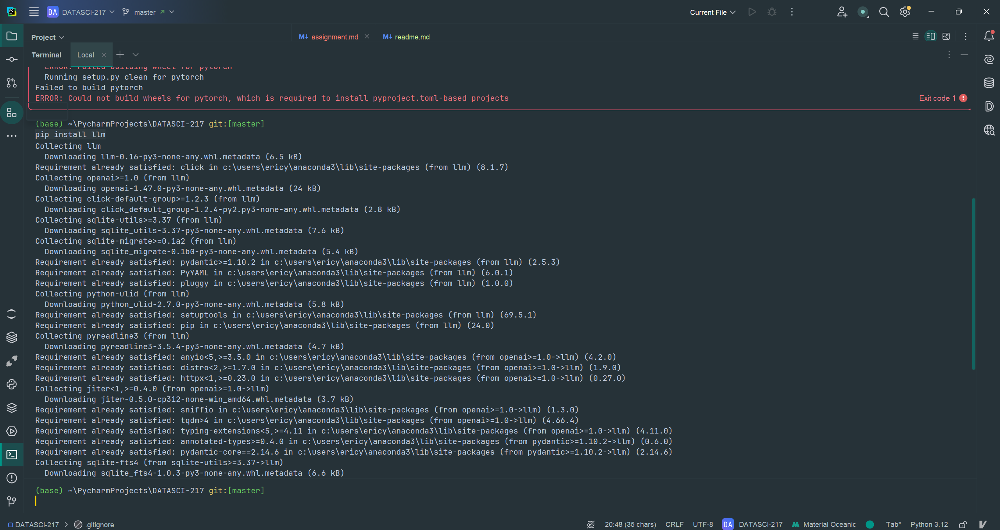

-  `#ffe4c4`
-  `#ffc300` 
# <span style="color:#ffe4c4; font-family: Spectral;">Assignment 2</span>
## <span style="color:#ffe4c4; font-family: Spectral;">Requested Information from Assignment 1:</span>
### <span style="color:#ffe4c4; font-family: Spectral;">Github Username</span>
<span style="color:#ffc300; font-family: Spectral;">@yangpings (Eric Yang)</span>

### <span style="color:#ffe4c4; font-family: Spectral;">Answer + Script </span>
<span style="color:#ffc300; font-family: Spectral;">
The answer is 233168. The script is below:
</span>

```python
num_sum = 0
for i in range(1,1000):
   if i % 3 == 0:
       num_sum = i + num_sum
   elif i % 5 == 0:
       num_sum = i + num_sum
   i += 1
print(num_sum)
```

### <span style="color:#ffe4c4; font-family: Spectral;">Brief introduction</span>
<span style="color:#ffc300; font-family: Spectral;">
I'm a current Health Data Science master's student aiming to 
apply statistical methods in healthcare research. I have used code 
for over four years in R, python, C++, and Java in my projects 
on machine learning and analyses; however, I self-taught most of 
the code, so I don't have ideal coding practices and habits. 
Therefore, I'm here to learn to code properly 
(as a software developer) and connect my work online instead 
of being an independent developer. I also aim to work in academia 
to develop AI models using python, so this course is really important
for me (I'll probably be asking a lot of out of the scope questions).
</span>

## <span style="color:#ffe4c4; font-family: Spectral;">New:</span>
### <span style="color:#ffe4c4; font-family: Spectral;"><a href="https://www.python.org">Link to the official Python website</a></span>
### <span style="color:#ffe4c4; font-family: Spectral;"> I can use pip- install hehe </span>
<span style="color:#ffc300; font-family: Spectral;">Please ignore the top part:D </span>
</img>
</img>


