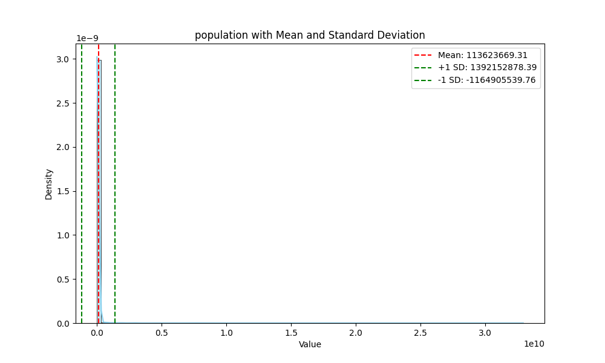

# Data Cleaning Project: Population Dataset
## 1. Initial State Analysis
### Dataset Overview

- **Name**: messy_population_data.csv
- **Rows**: 125718
- **Columns**: 5

### example of dataset
  income_groups  age  gender    year  population
0   high_income  0.0     1.0  1950.0   7798286.0
1   high_income  0.0     1.0  1951.0   7739711.0
2   high_income  0.0     3.0  1952.0   7713905.0
3   high_income  0.0     1.0  1953.0   7722053.0
4   high_income  0.0     1.0  1954.0   7756149.0

### Column Details
1. **Column names: Data Type, Non-null Count, Unique Values, Mean**
   - income_groups: float64,119412, 8, N/A
   - age: float64, 119495, 101, 5.000704e+01
   - gender: float64, 119811, 3, 1.578578
   - year: float64, 119516, 169, 2.025068e+03
   - population: float64, 119378, 114925, 1.112983e+08
   
### Identified Issues
1. **[Missing Values]**
   - Description: Values that are missing in the dataset.
   - Affected Column(s): income_groups(6306), age(6223), gender(5907), year(6202), and population(6340)
   - Example: high_income,,3.0,1960.0,8172589.0
   - Potential Impact: we should disregard missing values since they hold no value as a row though fragments might be valuable as well.
2. **[Row Duplicates]**
   - Description: There are duplicates of the dataset that needs to be investigated
   - Affected Column(s): All (2950 duplicates)
   - Potential Impact: Makes the data skewed and misleads the graph.
**Disclaimer**: I have also discovered a gender higher than 2. Since I have no idea what the numbers meant, I have left them as is.  
3. **[Outliers and Sense]**
   - Description: There are some datasets that don't make sense
   - Affected Column(s): Age, year
   - Potential Impact: Makes the data skewed.
**Disclaimer**: I have also discovered a gender higher than 2. Since I have no idea what the numbers meant, I have left them as is.  
### Code Snippets
```python
import pandas as pd
#import the dataset
data = pd.read_csv('messy_population_data.csv', delimiter=',')
dataset = pd.DataFrame(data)
#Details
print(dataset.shape)
print(dataset.head())
print(dataset.columns)
print(dataset.dtypes)
print(dataset.notnull().sum())
print(dataset.nunique())
print(dataset.mean(numeric_only=True))
#issues
print(dataset.isnull().sum())
print(dataset.duplicated().sum())
```
## 2. Data Cleaning Process
### Issue 1: [Missing Values]
- **Cleaning Method**: Through detecting missing values in any row and omit the entire row thus creating a cleaner version of it.
- **Implementation**:
```python
cleaned_df = dataset.dropna()
 ```
- **Justification**: Missing values are a priority to delete first, since it is clear that any missing data within each row should be disregarded before proceeding further.
- **Impact**: 
  - Rows affected: 28079
  - Data distribution change: 
    - (Mean, sd)
    - Age: 50.043, 29.151 </img>
    - gender: 1.5796, 0.5905 </img>
    - year: 2025, 43 </img>
    - population: 111254750.496, 1264046708.501 </img>

### Issue 2: [Row Duplicates]
- **Cleaning Method**: Detect any duplicates and delete them 
- **Implementation**:
```python
cleaned_df = cleaned_df.drop_duplicates()
 ```
- **Justification**: Row duplicates also skews the data set. By deleting the duplicates, the dataset as become cleaner after deleting rows wth missing values.
- **Impact**: 
  - Rows affected: 2214
  - Data distribution change: 
    - (Mean, sd)
    - Age: 50.03, 29.155 </img>
    - gender: 1.5813, 0.5922 </img>
    - year: 2025, 44 </img>
    - population: 113623669.312, 1278529209.07 </img>
### Issue 3: [Outliers and Senses]
- **Cleaning Method**: Detect any data that doesn't make sense and delete them 
- **Implementation**:
```python
condition = (cleaned_df['age'] > 17) & (cleaned_df['year'] < 2025) & (cleaned_df['population'] < 10000000)
cleaned_df = cleaned_df[condition]
```
- **Justification**: There are some errors on age and year that has some of the dataset data have made up data.
- **Impact**: 
  - Rows affected: 62272
  - Data distribution change: mean age increases, mean year diseases, mean population decreases. 
sd age, sd year, and sd population decreases. It makes sense because we filtered data that is unreasonable
    - (Mean, sd)
    - Age: 62.665, 23.24 </img>
    - gender: 1.581, 0.591 </img>
    - year: 1984, 21 </img>
    - population: 3021586.14, 2908985.53 </img>
Code for the graphs
```python
import matplotlib.pyplot as plt
import seaborn as sns
selected = ['age', 'gender', 'year', 'population']
for x in selected:
    mean = cleaned_df[x].mean()
    sd = cleaned_df[x].std()
    plt.figure(figsize=(10, 6))
    sns.histplot(cleaned_df[x], bins=100, kde=True, color='skyblue', stat="density")
    # Plotting the mean and standard deviation lines
    plt.axvline(mean, color='r', linestyle='--', label=f'Mean: {mean:.2f}')
    plt.axvline(mean + sd, color='g', linestyle='--', label=f'+1 SD: {mean + sd:.2f}')
    plt.axvline(mean - sd, color='g', linestyle='--', label=f'-1 SD: {mean - sd:.2f}')
    plt.title(f'{x} with Mean and Standard Deviation')
    plt.xlabel('Value')
    plt.ylabel('Density')
    plt.legend()
    plt.show()
```
## 3. Final State Analysis

### Dataset Overview
- **Name**: cleaned_population_data.csv 
- **Rows**: 33153
- **Columns**: 5

### Summary of Changes and Challenges faced
The immediate challenged I faced was the direction of the assignment. I have inspected 
and guessed the purpose of the dataset as being the population of each age in different 
social classes each year. I have seen ages from 0-100 and populations from 24 to billions, three genders 
and years from 1950-2100. However, in logical terms, all data after 2024 and ages under 18
should be deleted since the current year is 2024 and people cannot work before 18 years old.
The direction of this data set is not well done, ie. (are there three genders when recording this, 
is this a predictive dataset, what is the definition of the income group). Thus, I have interpreted this 
dataset into my own judgement: to omit those that don't seem to make sense. Thus, issue three is a personalized cleaning session.
